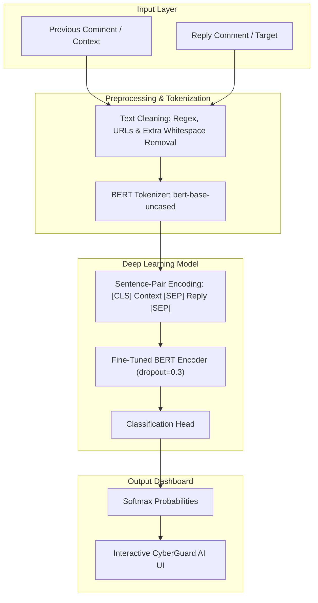

# 🛡️ Context-Aware Cyberbullying Detection using BERT

A state-of-the-art machine learning system that utilizes a fine-tuned **BERT (Bidirectional Encoder Representations from Transformers)** model to detect cyberbullying and harassment in online social media conversations. 

Unlike traditional text classifiers that inspect only single isolated comments, this system is **context-aware**—it evaluates both the **previous comment (context)** and the **reply comment** as a sentence pair to correctly identify nuanced bullying (such as sarcasm, retaliation, or context-dependent verbal abuse).

---

## 📐 System Architecture

The following diagram illustrates how conversation data flows from input to the final classification result:



---

## 🚀 Features

- **Contextual Sentence-Pair BERT Classifier**: Integrates conversation history to eliminate false positives/negatives in context-dependent phrases.
- **CyberGuard AI Dashboard**: A modern, interactive split-pane Streamlit web interface with responsive visualization.
- **Dynamic Category Highlighting**: Color-coded status updates matching specific categories:
  - ✅ **Safe (Not Cyberbullying)**
  - ⚠️ **Harassment Bullying**
  - 🚨 **Hate Speech Bullying**
  - 🔞 **Sexual Bullying**
- **Dynamic Progress Charts**: Real-time confidence metrics with custom-colored HTML5 progress bars matching the category color theme.
- **One-Click Safety Actions**: Direct integration to file official complaints with the National Cybercrime Portal if harmful content is detected.
- **CLI Mode**: Fast command-line interface for local scripting and testing.

---

## 🧠 Model & Training Specifications

The model is built on top of `bert-base-uncased` and fine-tuned using a custom `WeightedTrainer` subclass to address dataset class imbalances.

### Hyperparameters

| Parameter | Value | Description |
| :--- | :--- | :--- |
| **Epochs** | `3` | Number of training passes over the dataset |
| **Batch Size** | `32` | Training and Evaluation batch size |
| **Learning Rate** | `2e-5` | Initial learning rate for AdamW optimizer |
| **Max Sequence Length** | `128` | Token length limit for input sequences |
| **Dropout Probability** | `0.3` | Hidden layer and attention dropout to prevent overfitting |
| **Weight Decay** | `0.01` | Weight decay rate for regularization |
| **Warmup Ratio** | `0.1` | Proportion of training steps for learning rate warmup |
| **Class Weights** | `Balanced` | Dynamic loss scaling to compensate for underrepresented classes |

---

## 📁 Repository Structure

```text
├── app.py               # Streamlit web dashboard interface
├── predict.py           # CLI prediction and inference script
├── preprocess.py        # Dataset preprocessing utilities
├── train_bert.py        # BERT model training and fine-tuning pipeline
├── requirements.txt     # Python dependency configuration
└── .gitignore           # Git ignore configurations (ignores models, datasets, etc.)
```

---

## 🛠️ Installation & Setup

### 1. Clone the Repository
```bash
git clone https://github.com/Lokeshwar-09/Context-Aware-Cyberbullying-Detection.git
cd Context-Aware-Cyberbullying-Detection
```

### 2. Set Up Virtual Environment (Recommended)
```bash
python -m venv venv
# On Windows:
venv\Scripts\activate
# On macOS/Linux:
source venv/bin/activate
```

### 3. Install Dependencies
```bash
pip install -r requirements.txt
```

### 4. Setup Model Weights
Place your trained model files (weights, config, and `label_encoder.pkl`) inside the `models/` directory:
```text
models/
├── config.json
├── label_encoder.pkl
├── model.safetensors
├── special_tokens_map.json
├── tokenizer_config.json
└── vocab.txt
```
*(Note: These files are automatically ignored by Git to keep the repository size small.)*

---

## 💻 How to Run

### Run the Web Dashboard
Start the interactive Streamlit application in your browser:
```bash
streamlit run app.py
```

### Run CLI Prediction Tool
For running rapid predictions directly in your terminal:
```bash
python predict.py
```

---

## 📄 Dataset Preprocessing
The `preprocess.py` module cleans input texts using:
- Link/URL suppression (`http\S+`, `www\S+`)
- Whitespace normalization
- Control character removal
- Automatic encoding recovery (tries `utf-8` and falls back to `latin1`)
- Data cleaning (null entry removal and deduplication)

---

## 🤝 Contributing
Contributions, issues, and feature requests are welcome! Feel free to open a pull request or submit a ticket on the [issues page](https://github.com/Lokeshwar-09/Context-Aware-Cyberbullying-Detection/issues).
